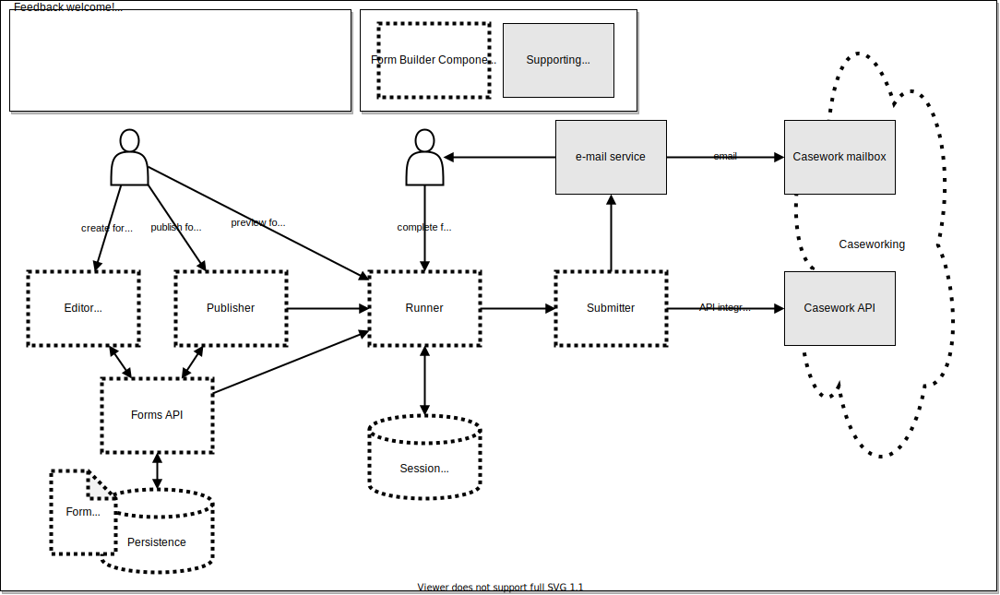

### About this page
This page aims to capture  common technical components and best practices for form building tools.

It is structured around the needs of the teams creating and/or maintaining forms.

At the bottom of the page, it includes links to the MOJ Forms and Home Office / FCDO XGovFormBuilder repositories as example implementations for some of these concepts.

This page should be reviewed and iterated on an ongoing basis with inputs from the cross-government form building community.

### Form Builders

A form builder is a hosted product that allows teams to create a custom form or a service with some pre-existing tools.

The x-gov form building community does not recommend any one particular form building tool. However, organisations can take steps to standardise components so there is consistency across form builders and forms.

### Advantages of form builders
Using a ready-made form builder allows service teams to:

- quickly and easily prototype designs
- reduce costs and development time of forms
- make services consistent and accessible
- reduce the complexity of making forms
- help teams to focus on the most important parts of their service like content design

### Common features of form builders

There are a number of form builders available and they have common features and functionality including:

- a user interface to help design, edit and visualise a form
- form components (for example, single questions, multiple questions)
- form templates
- design and layout tool
- form logic
- integration to backend systems (for example, case management or data stores, GOV.UK Notify, Address finder)

### Things to consider when developing or buying a form builder

If you are considering developing or buying a form building your should aim to make sure it:

- meets the needs of user (for example, content designers or developers)
- complies with any design requirement (for example, GOV.UK Design System, multi-language support)
- uses an open standard for form definition and ownership
- can handle your form logic needs (for example, branching, looping, skipping, one to many relations)
- integrates with your backend systems easily
- stores data in a secured way
- satisfies yours data access and privacy requirements
- has at least testing and production environments
- avoids locking your in to one vendor
- is evaluated so you know the total cost of ownership (for example, ongoing maintenance, specialist consultancy, any development costs)

### Addressing user needs with form builder components

Form builders should allow teams to address the following user needs with specific components:

1. **User need:** Create new forms and services as well as make changes to them

   **Component:** An Editor application allows users to create and edit a form, for example by adding or deleting pages or questions. A web-based interface provides the best user experience and then passes the form data to a different component to handle...

2. **User need:** Preview, share and test forms

   **Component:** A Runner application allows users to preview functionality and / or allow for a production form to be displayed to the user. The Runner can also include configurations to meet service requirements (for example, user session management to set limits to inactive sessions).  

3. **User need:** Manage the forms they own

   **Component:** Storage of the form metadata and controlled by the Metadata API

4. **User need:** Publish forms in test and production environments

   **Component:** A Publisher application, which integrates to a preferred cloud-hosting solution should allow users to publish forms. However, not all form builder tools have the functionality built-in.

5. **User need:** Process information in a secure way to fulfil end user service requests

   **Component:** A Submitter application can process data submitted when a form is completed. This data will need to conform with the information asset classification (with any handling caveats) and any GDPR and DPIA considerations.

### Case studies

- [MoJ form builder](/x-gov-form-community/form-terminology/example-MOJ)

- [Cross Government Form Builder](/x-gov-form-community/form-terminology/example-xgov)
